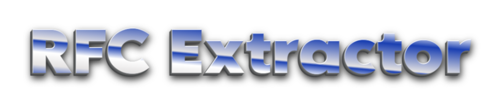

# RFC Extractor for Ravenfield

A modern, user-friendly tool for extracting `.bytes` files from Ravenfield's `.rfc` files. Built with Python and Kivy, featuring a Steam-like interface.



## Features

- 🎮 Steam-styled modern interface
- 📂 Native Windows file dialog for easy file selection
- 📊 Real-time progress tracking
- 🔄 Automatic file name preservation
- 💾 Batch extraction support
- 🎯 Focused on Ravenfield mod files

## Installation

1. Make sure you have Python 3.11+ installed
2. Clone this repository:
   ```bash
   git clone https://github.com/yourusername/RavienFieldTools.git
   cd RavienFieldTools
   ```
3. Install the required dependencies:
   ```bash
   pip install -r requirements.txt
   ```

## Usage

1. Run the application:
   ```bash
   python app.py
   ```
2. Click "Select RFC File" to choose your `.rfc` file
3. Click "Extract Files" to begin extraction
4. Extracted files will be saved in a new folder named `{original_file_name}_extracted`

## File Structure

```
RavienFieldTools/
├── app.py              # Main application file
├── Tool/
│   └── util.py        # Core extraction functionality
├── Images/
│   └── text.png       # Application assets
└── requirements.txt    # Python dependencies
```

## Requirements

- Python 3.11+
- UnityPy
- Kivy
- tkinter (usually comes with Python)

## Development

Want to contribute? Great! Here are the key files you'll want to look at:

- `app.py`: Contains the GUI implementation using Kivy
- `Tool/util.py`: Contains the core RFC extraction logic using UnityPy
- `requirements.txt`: Lists all Python dependencies

## License

This is free and unencumbered software released into the public domain.

Anyone is free to copy, modify, publish, use, compile, sell, or
distribute this software, either in source code form or as a compiled
binary, for any purpose, commercial or non-commercial, and by any
means.

In jurisdictions that recognize copyright laws, the author or authors
of this software dedicate any and all copyright interest in the
software to the public domain. We make this dedication for the benefit
of the public at large and to the detriment of our heirs and
successors. We intend this dedication to be an overt act of
relinquishment in perpetuity of all present and future rights to this
software under copyright law.

THE SOFTWARE IS PROVIDED "AS IS", WITHOUT WARRANTY OF ANY KIND,
EXPRESS OR IMPLIED, INCLUDING BUT NOT LIMITED TO THE WARRANTIES OF
MERCHANTABILITY, FITNESS FOR A PARTICULAR PURPOSE AND NONINFRINGEMENT.
IN NO EVENT SHALL THE AUTHORS BE LIABLE FOR ANY CLAIM, DAMAGES OR
OTHER LIABILITY, WHETHER IN AN ACTION OF CONTRACT, TORT OR OTHERWISE,
ARISING FROM, OUT OF OR IN CONNECTION WITH THE SOFTWARE OR THE USE OR
OTHER DEALINGS IN THE SOFTWARE.

For more information, please refer to <https://unlicense.org> 